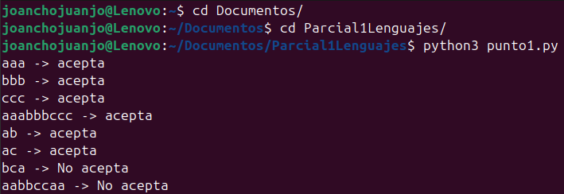
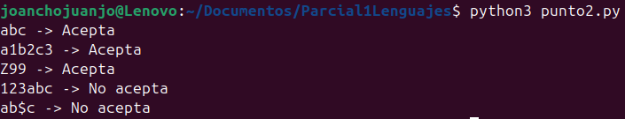
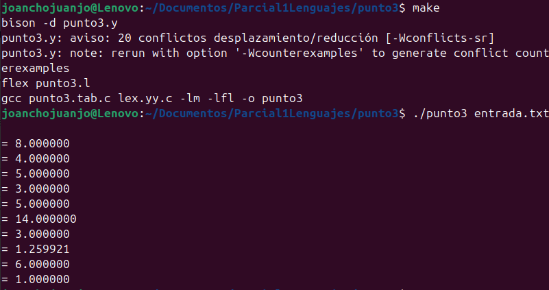

# Parcial1Lenguajes

#### 1.  Para el siguiente ejercicio, de una expresión regular que represente el conjunto descrito. [El conjunto de cadenas sobre {𝑎, 𝑏, 𝑐} en el cual todas las 𝑎′𝑠 preceden a las 𝑏′𝑠 y éstas a su vez preceden a las 𝑐′𝑠. Es posible que no haya 𝑎′𝑠, 𝑏′𝑠 o 𝑐′𝑠]. Implemente el AFD para esta expresión regular. Use Python.

La expresión regular para este AFD sería "a * b * c *", donde desmostramos la seguidilla de las letras, aclarando que pueden o no aparecer

<pre>
  def afd(cadena):
    estado = 'q0'
    finales = {'q0','q1','q2','q3'}

    for simbolo in cadena:
        if estado == 'q0':
            if simbolo == 'a':
                estado = 'q1'
            elif simbolo == 'b':
                estado = 'q2'
            elif simbolo == 'c':
                estado = 'q3'
            else:
                return 'No acepta'
        
        elif estado == 'q1':
            if simbolo == 'a':
                estado = 'q1'
            elif simbolo == 'b':
                estado = 'q2'
            elif simbolo == 'c':
                estado = 'q3'
            else:
                return 'No acepta'
        
        elif estado == 'q2':
            if simbolo == 'b':
                estado = 'q2'
            elif simbolo == 'c':
                estado = 'q3'
            else:
                return 'No acepta'
            
        elif estado == 'q3':
            if simbolo == 'c':
                estado = 'q3'
            else:
                return 'No acepta'
    
    return 'acepta' if estado in finales else 'no acepta'

pruebas = ['aaa', 'bbb', 'ccc', 'aaabbbccc', 'ab', 'ac', 'bca', 'aabbccaa']
for t in pruebas:
    print(t, '->', afd(t))
</pre>

#### 2. Si la expresión regular para un ID es la siguiente: [𝐴 −𝑍𝑎 − 𝑍][𝐴 − 𝑍𝑎 − 𝑧0 − 9] ∗. Implemente un AFD en Python. Realice mínimo 5 pruebas, tres donde “ACEPTE” y dos donde “NO ACEPTE”

<pre>
  def afd(cadena):
    estado = 'q0'
    final = {'q1'}

    letras = 'ABCDEFGHIJKLMNOPQRSTUVWXYZabcdefghijklmnopqrstuvwxyz'
    digitos = '0123456789'

    for i, simbolo in enumerate(cadena):
        if estado == 'q0':
            if simbolo in letras:
                estado = 'q1'
            else:
                return 'No acepta'
            
        elif estado == 'q1':
            if simbolo in letras + digitos:
                estado = 'q1'
            else:
                return 'No acepta'
        
    return 'Acepta' if estado in final else 'No acepta'

pruebas = ['abc','a1b2c3','Z99','123abc','ab$c']

for t in pruebas:
    print(t , '->' , afd(t))
</pre>

#### 3.  Escriba un programa en C que implemente una calculadora que pueda sacar raíz cubica de números reales. Use flex y Bison. La entrada debe ser por un archivo de texto y la salida debe ser por consola.

*Flex (Análisis Léxico)*

<pre>
%{
#include "punto3.tab.h"
#include <stdlib.h>
%}

%%

[0-9]+(\.[0-9]+)?    { yylval.fval = atof(yytext); return NUM; }
raiz3                { return RAIZ3; }
[+\-*/\n()]           { return yytext[0]; }
[ \t]                { /* ignorar espacios */ }
.                    { /* cualquier otro char lo ignoramos */ }

%%
</pre>

*Bison (Análisis Sintáctico / Gramático)*

<pre>
%{
#include <stdio.h>
#include <math.h>
#include <stdlib.h>

extern int yylex();
extern FILE *yyin;

void yyerror(const char *s);
%}

%union {
    double fval;
}

%token <fval> NUM
%token RAIZ3
%type <fval> exp

%%

input:
    /* vacío */
  | input exp '\n'   { printf("= %f\n", $2); }
  ;

exp:
    NUM                 { $$ = $1; }
  | exp '+' exp         { $$ = $1 + $3; }
  | exp '-' exp         { $$ = $1 - $3; }
  | exp '*' exp         { $$ = $1 * $3; }
  | exp '/' exp         { $$ = $1 / $3; }
  | '(' exp ')'         { $$ = $2; }
  | '-' exp             { $$ = -$2; }
  | RAIZ3 '(' exp ')'   { $$ = cbrt($3); }   /* <- aquí la raíz cúbica */
  ;

%%

void yyerror(const char *s) {
    fprintf(stderr, "Error: %s\n", s);
}

int main(int argc, char **argv) {
    if (argc > 1) {
        yyin = fopen(argv[1], "r");
        if (!yyin) {
            perror("No se pudo abrir el archivo");
            return 1;
        }
    }
    yyparse();
    return 0;
}
</pre>

*Entrada.txt (operaciones a realizar)*

<pre>
5+3
10-2*3
(4+6)/2
raiz3(27)
raiz3(64)+1
2*raiz3(8)+5
raiz3(125)-raiz3(8)
raiz3(2)
raiz3(8*27)
raiz3(1000)/10
</pre>

